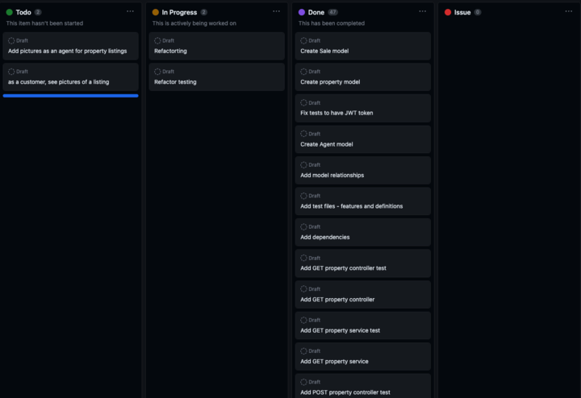

# Real-Estate API
## Table of Contents

- [Overview](#overview)
- [Approach](#approach)
- [Hurdles](#hurdles)
- [User Stories](#user-stories)
- [ERD Diagram](#erd-diagram)
- [API Endpoints](#api-endpoints)
- [Planning Documentation](#planning-documentation)
- [Future Work](#future-work)
- [Dependencies](#dependencies)

## Overview
Real Estate Management System: A RestAPI for a real estate management system that allows agents to create, delete, and update property listings, manage property sales, and allow all users to view properties listed.

## Tools and Technologies
* Java
* IDE - IntelliJ
* Spring Boot
* JPA
* JWT
* Maven
* Postman
* Cucumber Spring Integration

## Approach
We began our real-estate API by brainstorming the models needed. 
Once models were decided on (Agent, Property, and Sale), 
we created and ERD diagram showing the one-to-many and many-to-one relationships. 
We also broke down our User Stories into three categories: Bronze, Silver, and Gold. 
Completing both Bronze and Silver.  

After creating our models (Agent, Property, and Sale), 
we began by implementing our tests using Cucumber and Rest assured, as well as Behavior Driven Design (BDD). 
Once scenarios were created, we began to program our services, repositories, and controllers to 
test each CRUD method one-by-one ensuring that we were getting the expected end result both by 
running the tests in IntelliJ and in Postman.

## Hurdles
Our major hurdle was implementing security for cucumber testing. Specifically on the two code blocks below:  

This code block generate Jwt key, every time the agent logs in. 
```
    public String getSecurityKey() throws Exception {
        RequestSpecification request = RestAssured.given();
        JSONObject requestBody = new JSONObject();
        requestBody.put("email", "mail@gmail.com");
        requestBody.put("password", "123456");
        request.header("Content-Type", "application/json");
        response = request.body(requestBody.toString()).post(BASE_URL + port + "/auth/login/");
        return response.jsonPath().getString("message");
    }
```
The key generated in the code above is called in the request header for other tests.  
```
    RequestSpecification request = RestAssured.given().header("Authorization", "Bearer " + getSecurityKey());
```
We overcame this by writing a separate getSecurityKey() method inside the testing definitions.

## ERD Diagram


## User Stories
Bronze:
- As an agent, I should be able to login into my account so that get access to property listings.
- As an agent, I should be able to add a property listing so that others can see new property.
- As an agent, I should be able to update a property listing so that information for property changes for all users.
- As an agent, I should be able to delete a property listing so that property no longer listed.
- As an agent, I should be able to sell properties so that list of properties sold will be updated.

Silver:
- As a customer, I should be able to view all property listings so that I can choose a property I want to buy.
- As a customer, I should be able to filter properties based on price and size so that it's easier for me to find property.
- As a customer, I should be able to find properties listed by a specific agent so that I can see only listings from certain agent.

Gold:
- As an agent, I should be able to add pictures of the property listing so that users will know more about property.
- As a customer, I should be able to see pictures of the property listing so that it's easier to find property I like.


## API Endpoints

| Request Type | URL                                    | Functionality                   | Access  | 
|--------------|----------------------------------------|---------------------------------|---------|
| POST         | /auth/login/                           | User login               	      | Public  |
| POST         | /auth/register/                        | User registration        	      | Public  |
| POST         | /properties/                           | Create Property          	      | Private |
| PUT          | /properties/{id}/                      | Update Property         	       | Private |
| DELETE       | /properties/{id}/   	                  | Delete Property         	       | Private |
| GET          | /properties/                           | Properties 		                   | Public  |
| GET          | /properties/{id}/                      | Property           	            | Public  |
| GET          | /properties/size={size}/price={price}/ | Filter properties by parameters | Public  |
| GET          | /properties/agent/{agentId}/           | Get properties by agent         | Public  |
| GET          | /sales/                                | Get all sales                   | Private |
| GET          | /sales/{id}/                           | Get sale by id                  | Private |
| POST         | /properties/{propertyId}/sales/        | Add sale                        | Private |

## Planning Documentation
* Click [here](https://github.com/users/EdgarJoell/projects/1/views/1) to see our planning process.

<br> 

## Future Work



## Dependencies
* Spring Boot Starter
* Spring Boot Starter Test
* Spring boot Starter Web
* Spring Boot Starter Data JPA
* Spring Boot Devtools
* Spring Boot Starter Security
* H2 Database
* Spring Boot Starter JDBC
* JUnit
* Cucumber-Java
* Cucumber-JUnit
* Cucumber Spring
* Rest Assured
* JJwt API
* JJwt IMPL
* JJwt Jackson
