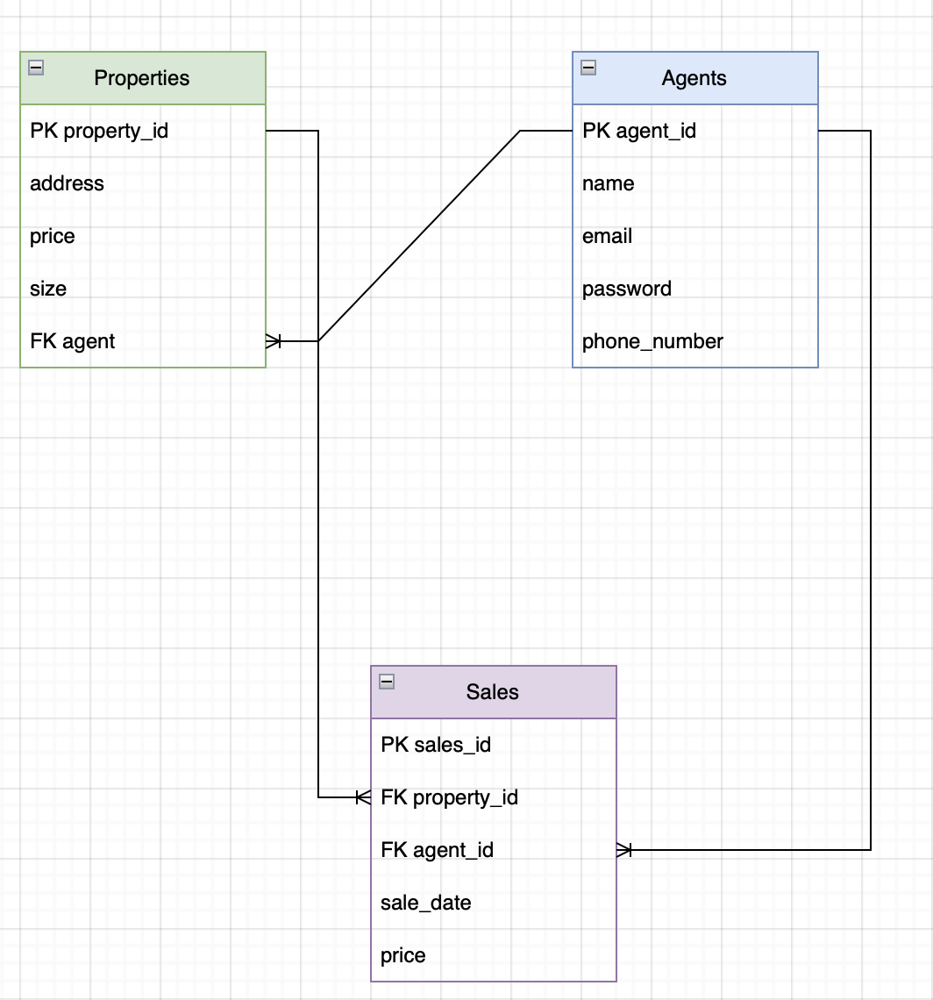

# Real-Estate API

## Overview
Real Estate Management System: A RestAPI for a real estate management system that allows agents to create, delete, and update property listings, manage property sales, and allow all users to view properties listed.

## Tools and Technologies
* Java
* IDE - IntelliJ
* Spring Boot
* JPA
* JWT
* Maven
* Postman
* Cucumber Spring Integration

## Approach
We began our real-estate API by brainstorming the models needed. 
Once models were decided on (Agent, Property, and Sale), 
we created and ERD diagram showing the one-to-many and many-to-one relationships. 
We also broke down our User Stories into three categories: Bronze, Silver, and Gold. 
Completing both Bronze and Silver.  

After creating our models (Agent, Property, and Sale), 
we began by implementing our tests using Cucumber and Rest assured, as well as Behavior Driven Design (BDD). 
Once scenarios were created, we began to program our services, repositories, and controllers to 
test each CRUD method one-by-one ensuring that we were getting the expected end result both by 
running the tests in IntelliJ and in Postman.

## User Stories
Bronze:
- As an agent, I should be able to login into my account to use the application and get access to property listings.
- As an agent, I should be able to add a property listing.
- As an agent, I should be able to update a property listing.
- As an agent, I should be able to delete a property listing.
- As an agent, I should be able to sell properties.

Silver:
- As a customer, I should be able to view all property listings.
- As a customer, I should be able to filter properties based on price, size.
- As a customer, I should be able to find properties listed by a specific agent.

Gold:
- As an agent, I should be able to add pictures of the property listing.
- As a customer, I should be able to see pictures of the property listing.

 

## ERD Diagram

 

## API Endpoints

| Request Type | URL                                    | Functionality                   | Access  | 
|--------------|----------------------------------------|---------------------------------|---------|
| POST         | /users/login/                          | User login               	      | Public  |
| POST         | /users/register/                       | User registration        	      | Public  |
| GET          | /properties/                           | Properties 		                   | Public  |
| GET          | /properties/{id}/                      | Property           	            | Public  |
| POST         | /properties/                           | Create Property          	      | Private |
| PUT          | /properties/{id}/                      | Update Property         	       | Private |
| DELETE       | /properties/{id}/   	                  | Delete Property         	       | Private |
| GET          | /properties/size={size}/price={price}/ | Filter properties by parameters | Public  |
| GET          | /properties/agent/{agentId}/           | Get properties by agent         | Public  |
| GET          | /sales/                                | Get all sales                   | Private |
| GET          | /sales/{id}/                           | Get sale by id                  | Private |
| POST         | /property/{propertyId}/sales/          | Add sale                        | Private |

## Dependencies
* Spring Boot Starter
* Spring Boot Starter Test
* Spring boot Starter Web
* Spring Boot Starter Data JPA
* Spring Boot Devtools
* Spring Boot Starter Security
* H2 Database
* Spring Boot Starter JDBC
* JUnit
* Cucumber-Java
* Cucumber-JUnit
* Cucumber Spring
* Rest Assured
* JJwt API
* JJwt IMPL
* JJwt Jackson
